# Phone board layouts for Klondike and Spider

Klondike and Spider are hard to play on a phone. This plan measures why,
collects what phone solitaire apps do, and sets out two new board arrangements
per game and orientation beside today's, with the engine work each one needs.
The owner's choices are under [Decisions](#decisions); the work is tracked in
[phone-board-layouts-log.md](phone-board-layouts-log.md).

**Scope:** Klondike and Spider only. Klondike's variants (Whitehead, Thumb and
Pouch, Saratoga) and Spider's suit counts share their game's grid, so they come
along. Every other game keeps today's layout until these two are settled, and
gets its own follow-up.

The sketches in [`phone-board-layouts/`](phone-board-layouts/) are drawn to
scale from the same layout math as the figures beside them. Dark bars are the
app's own chrome (header, side rail, tool bar), and a red triangle on the bottom
edge marks a column that runs off the screen. A strip is the face-up part of
each card in a column, in CSS pixels.

## What shipped

Built on `feature/phone-board-layouts`, following the decisions below. Where it
differs from the sketches:

- **One bar at the bottom.** An upright phone docks the whole header at the
  bottom rather than splitting a status strip from a tool bar (K-P2's sketch),
  for every game.
- **S-P2 draws whole foundations** in columns 0 to 7 rather than overlapped
  runs, since the bottom row is one card tall either way; the stock shows one
  sliver per deal.
- **S-L2 uses one rail** at the right for the stock and the foundations, rather
  than half-hidden piles at both edges. The cards come out the same size.
- **A waste at the right spreads towards the stock**, each card right of the one
  under it, so the covered cards keep their index in view.
- **A left hand mirrors the piles but not the columns**, which stay in the order
  they are dealt, as phone solitaire apps do.
- **Fans fit only on the phone grids**, with a floor of 40 design units and a
  cap of 110. The grids for larger screens are unchanged.

The layout management is general: another game takes on phone grids by declaring
its board to the builder in `src/games/common/arranged_layouts.ts` and naming the
result on its catalog entry.

**Since then** the upright pile setting and the hand became Piles (Auto, Top,
Bottom) and Stock Side (Auto, Left, Right), offered on every screen, with a
larger screen's grid for the piles below and a sideways one for the rails on
the bottom; see [board-arrangement-log.md](board-arrangement-log.md). Most of
the other games took the same grids afterwards; see
[arranged-layouts-other-games-log.md](arranged-layouts-other-games-log.md).

## In short

1. **The cards are not the problem.** At 390 px wide our cards are already as
   big as phone apps draw them: 54 px in Klondike and 38 px in Spider. The
   problem is how much of each face-up card shows in a column: 11 px in Klondike
   and 8 px in Spider, a quarter of a 44 pt touch target. Meanwhile the board
   leaves two-thirds of a portrait screen empty.
2. **Landscape has the opposite problem.** A sideways phone is wider than the
   720 px compact breakpoint, so it gets the desktop header, gaps and cards.
   Columns never compress, so a Klondike column with six hidden cards runs off
   the bottom once three cards are built on it.
3. **One engine change fixes most of portrait.** Let columns fan to fit the
   space below them, wider when there is room and tighter when there is not.
   With no pile moved, the strip grows to 27 px in Klondike and 19 px in Spider.
4. **Landscape also needs the piles moved off the top row.** Moving Klondike's
   foundations and stock to side rails, and Spider's stock and completed runs to
   the screen edges, gives the columns the full height and keeps the longest
   realistic column on screen.

| Game and orientation | Pick                | Arrangement                                           |
| -------------------- | ------------------- | ----------------------------------------------------- |
| Klondike, portrait   | K-P1, then try K-P2 | Columns fan to fit; piles in thumb reach as a setting |
| Klondike, landscape  | K-L2                | Tableau in the middle, piles on rails                 |
| Spider, portrait     | S-P2                | Tableau first, dock at the bottom                     |
| Spider, landscape    | S-L2                | Columns full height, piles at the edges               |

## At a glance

Figures are for the reference screens below: 390 × 700 in portrait and 780 × 340
in landscape.

| Option   | Arrangement                                           | Card (px) | Strip, busy       | Strip, long       |
| -------- | ----------------------------------------------------- | --------- | ----------------- | ----------------- |
| K-P0     | Today                                                 | 54 × 76   | 10.9 px           | 10.9 px           |
| **K-P1** | Classic, columns fan to fit (recommended)             | 54 × 77   | 27.1 px           | 27.1 px           |
| K-P2     | Piles in thumb reach (try as a setting)               | 54 × 77   | 27.1 px           | 27.1 px           |
| K-L0     | Today                                                 | 67 × 95   | 13.7 px, runs off | 13.7 px, runs off |
| K-L1     | Classic, side rail, columns fit                       | 82 × 116  | 14.9 px           | 14.9 px, runs off |
| **K-L2** | Tableau in the middle, piles on rails (recommended)   | 76 × 108  | 37.9 px           | 17.2 px           |
| S-P0     | Today                                                 | 38 × 53   | 7.6 px            | 7.6 px            |
| S-P1     | Classic, columns fan to fit                           | 38 × 54   | 19.1 px           | 19.1 px           |
| **S-P2** | Tableau first, dock at the bottom (recommended)       | 38 × 54   | 19.1 px           | 19.1 px           |
| S-L0     | Today                                                 | 46 × 65   | 9.4 px            | 9.4 px, runs off  |
| S-L1     | Classic, side rail, columns fit                       | 70 × 100  | 15.0 px           | 12.7 px, runs off |
| **S-L2** | Columns full height, piles at the edges (recommended) | 64 × 90   | 31.5 px           | 15.7 px           |

## What goes wrong today

Seen at 390 × 844 and 844 × 390 in Chrome's phone emulation, and worked through
the layout math in `src/engine/render/layout/table_layout.ts`. The points where
columns run off are computed.

1. **Portrait leaves most of the screen empty.** The board is scaled to fit the
   width, and each game reserves a fixed design height (877 units for Klondike,
   1277 for Spider). On a 390 × 700 visible area Klondike's board ends 212 px
   below the header and Spider's 217 px. The rest is bare felt.
2. **Face-up strips are too thin to touch.** Columns fan by a fixed 45 units per
   face-up card: 10.9 px in Klondike and 7.6 px in Spider. Apple asks for 44 pt
   touch targets and Android for 48 dp. The mobile deck's rank is about 6 px
   tall on ten columns.
3. **Long columns run off the bottom in landscape.** Fans never compress. With
   the board held to the height of a 780 × 340 screen under the 73 px header,
   Klondike's seventh column (six hidden cards) leaves the screen once it holds
   three face-up cards. A Spider column leaves it past about eleven.
4. **A sideways phone is treated as a desktop.** `COMPACT_MAX_WIDTH_CSS_PX`
   (720) tests width alone. At 780 to 850 px wide the header is the full bar,
   21% of the height; gaps go back to 30 and 40 units; and the Auto card style
   picks desktop cards, the open question left from the mobile deck.
5. **A tap only moves a card if it is a double tap.** A single press draws from
   the stock and does nothing else, and dragging a 38 px card hides it under the
   finger. This is not layout, but it decides how much a layout has to make room
   for dragging.

## What phone solitaire apps do

- **Columns compress to fit.** HonestSolitaire's phone layout shrinks the
  face-up offset evenly when a column would pass the tableau's bottom, "never
  below 7 points". On a 390 pt frame it draws Klondike cards at 48 × 72 pt and
  Spider at 34 × 52 pt.
- **Spider's extra piles shrink to slivers.** The same layout puts completed
  runs at the left as slivers and the stock at the right, "showing one sliver
  per remaining deal".
- **A left or right layout setting.** Microsoft Solitaire Collection lets the
  player choose a Left or Right "Layout direction". MobilityWare offers right-
  or left-handed play and an Auto or fixed orientation.
- **Tap to move is the main input.** MobilityWare's Spider lists "tap to move
  for quick gameplay". One-handed solitaire apps go further: "tap-to-move, so
  you never drag anything".
- **Tools under the thumb.** HonestSolitaire reserves a fixed 84 pt tool row at
  the bottom of a portrait screen, with the tableau stopping 8 pt above it.

Our cards are already the size these apps use. The gap is in how much of each
card a column shows and how much of the screen the board gets.

## Ground rules for every option

- **Reference screens:** portrait 390 × 700 and landscape 780 × 340 CSS px, the
  visible area of a 6.1-inch phone with the browser's bars showing.
- **Card width in portrait** is set by the column count. Seven or ten columns
  across 390 px give about 54 or 38 px whatever else moves, so portrait options
  differ in reach and strip, not in card size.
- **Strip floor: 40 units.** The mobile deck draws its rank from 6 to 42 units
  down the strip (`INDEX_TOP`, `RANK_CAP_H` in
  `tools/card-atlas/mobile-deck.mjs`). A tighter fan starts to cut the rank.
- **Strip cap: 110 units,** about a third of a card, so a short column still
  reads as a column.
- **Hidden cards first.** Face-down gaps tighten from 18 to 10 units before
  face-up gaps go below what they need.
- **Test columns:** Klondike busy is 6 hidden + 6 face-up, long is 6 + 12.
  Spider busy is 5 + 8, long is 5 + 15.

## The options

### Klondike, portrait

Seven columns across 390 px fix the card at about 54 px whatever else moves.
There is height for every option, so the choice is about reach and familiarity.

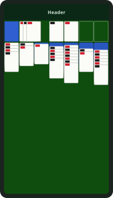
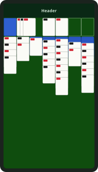
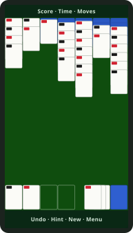

#### K-P0: Today

Card 54 × 76 px; strip 10.9 px on a busy column, 10.9 px on a long one.

The classic top row. The board is scaled to the screen's width and stops about
212 px below the header.

Costs:

- Two-thirds of the screen is bare felt
- 11 px face-up strips, a quarter of a 44 pt touch target

#### K-P1: Classic, columns fan to fit (recommended)

Card 54 × 77 px; strip 27.1 px on a busy column, 27.1 px on a long one.

The same arrangement with gaps tightened from 8 to 4 units. Each column fans
into the space below it, up to a third of a card.

Gains:

- Strips 2.5× taller
- Nothing new to learn
- Every game that fans its columns can use it

Costs:

- The stock stays top left, the hardest corner for a right thumb (a mirror
  setting moves it right)

Needs [B1](#b1-tell-a-phone-from-a-narrow-window),
[B2](#b2-columns-that-fan-to-fit).

#### K-P2: Piles in thumb reach (try as a setting)

Card 54 × 77 px; strip 27.1 px on a busy column, 27.1 px on a long one.

Foundations, waste and stock move to a row above a bottom tool bar, and the
header shrinks to a status strip. Columns hang from the top.

Gains:

- The stock, pressed dozens of times a game, sits under the thumb
- Undo and New Game are in reach too
- Same strips as K-P1, because portrait has height to spare

Costs:

- Unfamiliar to Klondike players
- Columns grow towards the pile row
- Needs a waste that fans to the left

Needs [B1](#b1-tell-a-phone-from-a-narrow-window),
[B2](#b2-columns-that-fan-to-fit), [B3](#b3-a-grid-per-orientation),
[B4](#b4-chrome-that-steps-aside).

**Pick:** Ship **K-P1** first. It is nearly free once columns fan to fit. Then
build **K-P2** behind a setting and decide after playing it on a phone.

### Klondike, landscape

Height is the limit. Today the header and the top row take more than half of it
before the first column starts.

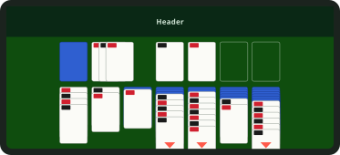
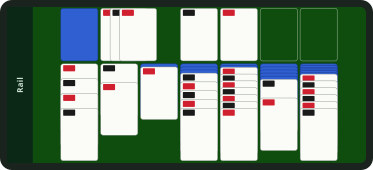
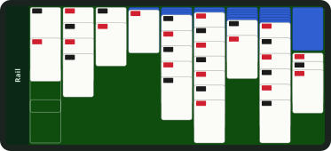

#### K-L0: Today

Card 67 × 95 px; strip 13.7 px, runs off on a busy column, 13.7 px, runs off on
a long one.

The desktop header and gaps, because a sideways phone is wider than the 720 px
compact breakpoint.

Costs:

- The header takes 21% of the height
- The seventh column runs off the screen once three cards are built on it

#### K-L1: Classic, side rail, columns fit

Card 82 × 116 px; strip 14.9 px on a busy column, 14.9 px, runs off on a long
one.

The header becomes a 56 px rail on the left. The top row stays, and columns fan
to fit.

Gains:

- The biggest cards of any option
- Familiar

Costs:

- Only about two card heights are left under the top row, so a long column still
  runs off at the 40-unit floor

Needs [B1](#b1-tell-a-phone-from-a-narrow-window),
[B2](#b2-columns-that-fan-to-fit), [B4](#b4-chrome-that-steps-aside).

#### K-L2: Tableau in the middle, piles on rails (recommended)

Card 76 × 108 px; strip 37.9 px on a busy column, 17.2 px on a long one.

Foundations stack down the left, each overlapping the next. The stock sits top
right with the waste fanning down under it. Columns start at the top and get the
full height.

Gains:

- Every realistic column fits
- Stock under the right thumb, actions under the left
- Cards bigger than today's

Costs:

- Overlapped foundations are smaller targets for a drag (a tap sends a card
  there anyway)
- A second arrangement to keep in step with the first

Needs [B1](#b1-tell-a-phone-from-a-narrow-window),
[B2](#b2-columns-that-fan-to-fit), [B3](#b3-a-grid-per-orientation),
[B4](#b4-chrome-that-steps-aside).

**Pick:** **K-L2**. It is the only option that keeps a long column on screen,
and it still draws bigger cards than today.

### Spider, portrait

Ten columns leave a 38 px card. The top row is mostly eight foundations that a
player never touches, since a completed run moves there on its own.

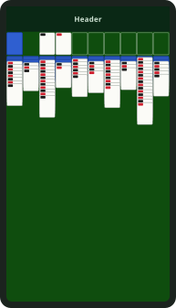
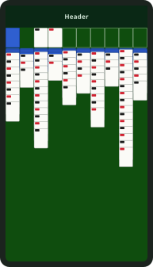
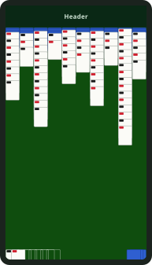

#### S-P0: Today

Card 38 × 53 px; strip 7.6 px on a busy column, 7.6 px on a long one.

Ten columns under a top row of the stock and eight foundations.

Costs:

- 7.6 px face-up strips
- Three-quarters of the screen is bare felt

#### S-P1: Classic, columns fan to fit

Card 38 × 54 px; strip 19.1 px on a busy column, 19.1 px on a long one.

Gaps tightened from 8 to 3 units; columns fan into the empty space below.

Gains:

- Strips 2.5× taller
- Nothing new to learn

Costs:

- A whole card row goes to foundations a player never touches
- The stock stays top left

Needs [B1](#b1-tell-a-phone-from-a-narrow-window),
[B2](#b2-columns-that-fan-to-fit).

#### S-P2: Tableau first, dock at the bottom (recommended)

Card 38 × 54 px; strip 19.1 px on a busy column, 19.1 px on a long one.

The stock and completed runs peek up from the bottom edge, the stock as one
sliver per remaining deal. Columns start right under the header.

Gains:

- The stock is in thumb reach
- Freeing the top row leaves room to raise the strip cap to about 28 px
- Room for a taller index later (B6)

Costs:

- Completed runs show as slivers, not whole cards
- Needs a stock drawn as slivers

Needs [B1](#b1-tell-a-phone-from-a-narrow-window),
[B2](#b2-columns-that-fan-to-fit), [B3](#b3-a-grid-per-orientation).

**Pick:** **S-P2**. S-P1 comes first as a step on the way, since S-P2 needs the
same flexible fans plus a portrait grid.

### Spider, landscape

The hardest case: ten columns and runs of a dozen or more cards in about 340 px
of height.

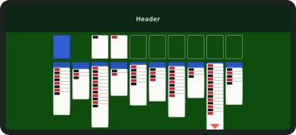
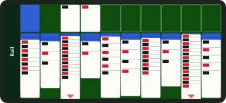
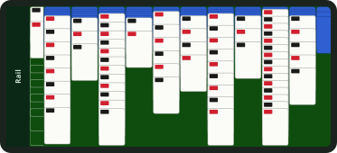

#### S-L0: Today

Card 46 × 65 px; strip 9.4 px on a busy column, 9.4 px, runs off on a long one.

The desktop header and gaps; the board is held to the height and centred.

Costs:

- 9.4 px strips
- A column runs off past about eleven face-up cards

#### S-L1: Classic, side rail, columns fit

Card 70 × 100 px; strip 15.0 px on a busy column, 12.7 px, runs off on a long
one.

A side rail replaces the header; the top row stays and columns fan to fit.

Gains:

- 70 px cards

Costs:

- Long columns still run off: the top row takes a full card height

Needs [B1](#b1-tell-a-phone-from-a-narrow-window),
[B2](#b2-columns-that-fan-to-fit), [B4](#b4-chrome-that-steps-aside).

#### S-L2: Columns full height, piles at the edges (recommended)

Card 64 × 90 px; strip 31.5 px on a busy column, 15.7 px on a long one.

Completed runs stack down the left edge and the stock down the right, each
showing only its left half. The ten columns run the full height.

Gains:

- Every column fits, even four hidden cards under twenty face-up ones
- 31 px strips on a busy column
- Stock under the right thumb

Costs:

- Half-hidden piles need a generous press area
- The narrowest rails of any option

Needs [B1](#b1-tell-a-phone-from-a-narrow-window),
[B2](#b2-columns-that-fan-to-fit), [B3](#b3-a-grid-per-orientation),
[B4](#b4-chrome-that-steps-aside).

**Pick:** **S-L2**. Giving the columns the whole height is the only way the long
runs Spider builds stay on screen.

## Building blocks

### B1. Tell a phone from a narrow window

Replace the width-only compact test with a form factor of phone portrait, phone
landscape or roomy, decided by the shorter side of the window (for example under
500 CSS px) rather than its width.

- **Where:** `ViewportService` in `src/ui/app/service/viewport.service.ts`;
  `compactFor` in `src/engine/render/layout/table_layout.ts`; the card style's
  Auto rule in `src/ui/app/service/presentation_settings.service.ts`.
- **Unlocks:** compact chrome, tight gaps and the mobile deck on a sideways
  phone; choosing a grid by orientation.

### B2. Columns that fan to fit

Each frame, a fanned pile is given the height between its origin and the board's
bottom (or the next pile below it) and spreads its face-up gaps between the
floor and the cap, tightening hidden cards first. The drawn cards, the drop
rectangles and the stack in hand must all read the same offsets, or a drop lands
somewhere other than where its highlight showed. Games opt in, and only Klondike
and Spider do for now, so every other game keeps its look until the follow-up.
An opted-in game's `designHeightPx` then shrinks to its grid plus a few strips.

- **Where:** `fanDownOffsets` in `src/engine/render/layout/pile_layout.ts`;
  `TableViewStateBuilder` and the held stack's `fanGap` in
  `src/engine/tableau/view/table_view_builder.ts`; `computeDropGeometries` in
  `src/engine/render/layout/drop_geometry.ts`.
- **Unlocks:** K-P1, S-P1, K-L1, S-L1, and every option after them.

### B3. A grid per orientation

Let a catalog entry declare a portrait and a landscape grid beside its default,
and have `measureTable` pick one per viewport. Slots take fractional positions,
for overlapped rails, and a grid may override a pile's arrangement: a waste
fanning down or left, a stock drawn as slivers. Turning the phone already
re-measures the board and snaps every card.

- **Where:** `CatalogEntry.layout` in `src/ui/app/provider/game_catalog.ts`;
  `SlotPlacement` and `measureTable` in
  `src/engine/render/layout/table_layout.ts`; `ZoneLook.layout` in
  `src/engine/tableau/view/zone_look.ts`; new `PileLayout` kinds in
  `src/engine/render/layout/pile_layout.ts`.
- **Unlocks:** K-P2, K-L2, S-P2, S-L2.

### B4. Chrome that steps aside

A side rail in phone landscape and an optional bottom tool bar in portrait. The
board learns insets on all four sides, not just the top, and the page opts into
`viewport-fit=cover` with safe-area insets so a notch does not cover a column.

- **Where:** the `header_bar` component; `--board-inset-top` in
  `src/ui/app/component/game_canvas/game_canvas.component.scss` and
  `ViewportScaler` in `src/engine/render/phaser/viewport_scaler.ts`; the
  viewport meta in `index.html`.
- **Unlocks:** the 73 px header back for cards in landscape; thumb-reach actions
  in K-P2.

### B5. Left-handed mirror

A setting that flips each grid's columns and turns a rightward fan into a new
leftward one, as Microsoft Solitaire Collection and MobilityWare offer.

- **Where:** the grid chosen in B3, applied in `computePileOrigins`; a
  `fan-left` kind beside `fan-right`.
- **Unlocks:** every option for left-handed players.

### B6. Later: a taller index, and tap to move

Portrait strips of 19 to 28 px have room for an index about twice today's
height; a second generated deck could fill them. Separately, a single tap that
sends a card to its best move, offered as a setting on touch screens, matters as
much as any layout.

- **Where:** `tools/card-atlas/mobile-deck.mjs`; `tableGestures` in
  `src/engine/tableau/table_gestures.ts`.
- **Unlocks:** legible Spider indices in portrait; play without dragging.

## Phases

### Phase 1: fans that fit, phones that are phones

B1, B2, and the landscape rail from B4. Klondike and Spider get K-P1, S-P1, K-L1
and S-L1 on today's grids.

Done when:

- Unit tests cover the fan fit, floor and cap in `engine/render`.
- A screenshot set of both games in both orientations at 360, 390 and 430 px
  wide shows no column off screen at the test shapes.
- A stack dropped on a squeezed column lands where its highlight showed.
- Every other game looks exactly as it does today.

### Phase 2: grids per orientation

B3 and B5. K-L2, S-L2 and S-P2 become the phone grids; K-P2 ships behind a
setting for playtesting.

Done when:

- Turning the phone mid-game keeps every card and the undo history.
- A drag in progress when the phone turns goes back to its pile.
- The mirrored grids play the same as the originals.

### Phase 3: index and input

B6: the taller-index deck for portrait strips, and tap to move.

Done when:

- A ten-column rank reads at arm's length on a real phone.
- A game can be won without a drag.

## Decisions

Made by the project owner on 2026-10-04. The work, and the choices made while
building it, are tracked in
[phone-board-layouts-log.md](phone-board-layouts-log.md).

1. **Upright phone:** the piles go to the bottom (K-P2, S-P2) by default for
   both games, with the classic grid and fitted fans (K-P1, S-P1) offered as a
   setting.
2. **Phone on its side:** the header becomes a rail down the side (K-L2, S-L2).
3. **Left-handed mirror:** in this release.
4. **Fans:** each column fits on its own, with a cap on how far a short column
   opens.

## Sources

- [HonestSolitaire #73: lay out both boards for any phone, compressing tall columns and mirroring for left-handed play](https://github.com/honestarcade/HonestSolitaire/issues/73)
- [Xbox Support: How do I change the layout in Solitaire?](https://support.xbox.com/en-US/game/microsoft-casual-games/microsoft-solitaire-collection/support/how-do-i-change-the-layout-in-solitaire)
- [MobilityWare Help Center: How do I play in landscape orientation?](https://mobilityware.helpshift.com/hc/en/10-solitaire/faq/507-how-do-i-play-in-landscape-orientation-1579115589/)
- [Spider Solitaire MobilityWare on the App Store](https://apps.apple.com/us/app/spider-solitaire-mobilityware/id391855805)
- [Solitaire by MobilityWare on the App Store](https://apps.apple.com/us/app/solitaire/id359917414)
- [Solitaire Association: one-handed mobile games](https://www.solitaireassociation.com/blog/best-one-handed-mobile-games-parents)
